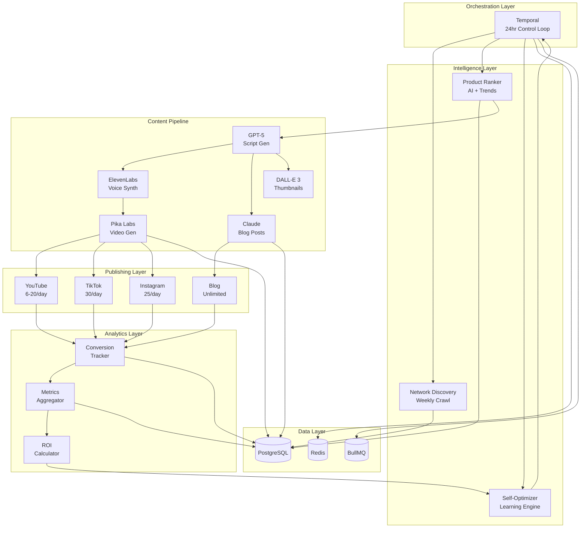
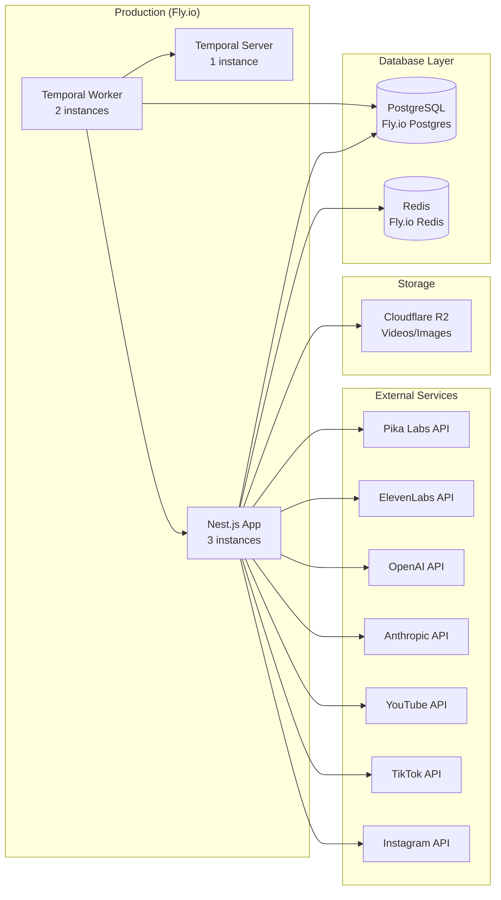

# AI Affiliate Empire - System Architecture

**Last Updated**: 2025-10-31
**Status**: Architecture Approved for Implementation

## High-Level Architecture



## Component Details

### 1. Orchestration Layer (Temporal)
- **24-hour autonomous control loop**
- Coordinates all modules in sequence
- Self-healing on failures (auto-retry)
- Workflow durability (survives crashes)
- Scheduling: Daily cycle + weekly tasks

### 2. Intelligence Layer

#### Network Discovery
- Web crawl affiliate program directories
- Parse API documentation
- Test connectivity
- Store credentials securely
- Schedule: Weekly

#### Product Ranker
- Fetch products from networks
- Enrich with trend data (Google Trends, TikTok API)
- Calculate composite rank score
- Select top 50 for content generation
- Schedule: Every 6 hours

#### Self-Optimizer
- A/B test prompts (10% traffic)
- Kill poor niches (ROI < 50%)
- Scale winners (ROI > 300%)
- Adjust platform allocation
- Auto-tune strategies
- Schedule: Weekly + emergency triggers

### 3. Content Pipeline

#### Script Generator (GPT-5)
- Input: Product data + niche + target audience
- Output: Video script (60s) + blog outline
- Prompt versioning for A/B tests
- Cost: ~$0.10 per script

#### Voice Synthesizer (ElevenLabs)
- Input: Script text
- Output: Natural voice audio
- Voice: "Adam" (professional male)
- Languages: English (primary), expand later
- Cost: ~$0.07 per voice

#### Video Generator (Pika Labs)
- Input: Script visual prompts + voice audio
- Output: 9:16 vertical video (60s)
- Style: Stylized, social media optimized
- Generation time: 30-90 seconds
- Cost: Subscription ($28/month for 2000)

#### Blog Generator (Claude 3.5)
- Input: Product data + keywords
- Output: SEO-optimized blog post (1500 words)
- Includes: Title, meta description, headings, affiliate links
- Cost: ~$0.05 per post

#### Thumbnail Generator (DALL-E 3)
- Input: Script thumbnail prompt
- Output: Eye-catching thumbnail (1024x1024)
- Style: Bold text + product imagery
- Cost: ~$0.04 per image

### 4. Publishing Layer

#### YouTube Shorts
- Limit: 6-20 videos/day per account
- Strategy: 10/day, staggered 2.5hr apart
- Peak times: 2pm, 5pm, 8pm EST
- API: YouTube Data API v3
- Auth: OAuth2 with refresh tokens

#### TikTok
- Limit: 30 videos/day
- Strategy: 20/day, hourly 6am-2am
- Peak times: 9am, 12pm, 6pm, 9pm EST
- API: Content Posting API (requires approval)
- Fallback: Playwright automation

#### Instagram Reels
- Limit: 25 posts/day (all types combined)
- Strategy: 10 Reels/day, 2hr gaps
- Peak times: 11am, 2pm, 7pm EST
- API: Instagram Graph API
- Auth: Facebook OAuth

#### Blog/Website
- Limit: Unlimited
- Strategy: 10 posts/day
- SEO: Target long-tail keywords
- CMS: Next.js with MDX
- Hosting: Vercel

### 5. Analytics Layer

#### Conversion Tracker
- UTM parameters on affiliate links
- Click tracking via redirect service
- Conversion webhooks from networks
- Store: PostgreSQL with timestamps

#### Metrics Aggregator
- Sync from platform APIs hourly
- Metrics: Views, likes, comments, shares, clicks
- Calculate: CTR, conversion rate, revenue
- Store: Time-series data in PostgreSQL

#### ROI Calculator
- Formula: (Revenue - Costs) / Costs * 100
- Per product, niche, platform, prompt version
- Triggers optimization on thresholds
- Feeds learning loop

### 6. Data Layer

#### PostgreSQL
- Products catalog
- Content pieces (scripts, videos, blogs)
- Publications (platform posts)
- Analytics (metrics, conversions)
- Experiments (A/B tests)
- Optimization logs

#### Redis
- API rate limit counters
- Platform upload quotas
- Session management
- Cache frequently accessed data (15min TTL)

#### BullMQ
- Publishing job queue
- Analytics sync jobs
- Content generation queue
- Retry logic for failures

## Data Flow

### Daily Cycle (24 hours)

```
00:00 - Start Cycle
  ↓
00:05 - Check for new networks (weekly)
  ↓
00:15 - Fetch products from all networks
  ↓
01:00 - Rank products (trend analysis)
  ↓
02:00 - Select top 50 products
  ↓
02:30 - Generate content (parallel)
        - 10 video scripts (YouTube)
        - 20 video scripts (TikTok)
        - 10 video scripts (Instagram)
        - 10 blog posts
  ↓
04:00 - Generate videos (parallel)
        - Voice synthesis
        - Video generation
        - Thumbnail creation
  ↓
06:00 - Start publishing (staggered throughout day)
        - YouTube: 10 videos over 25 hours
        - TikTok: 20 videos over 20 hours
        - Instagram: 10 videos over 20 hours
        - Blog: 10 posts immediate
  ↓
Parallel: Analytics sync every hour
  ↓
20:00 - Aggregate analytics
  ↓
21:00 - Run optimization
        - Evaluate prompt performance
        - Assess niche ROI
        - Adjust strategies
  ↓
22:00 - Generate owner report
  ↓
23:00 - Sleep until next cycle
  ↓
00:00 - Repeat
```

### Weekly Tasks

**Sunday 03:00**
- Discover new affiliate networks
- Test API connectivity
- Add to database if valid

**Monday 03:00**
- Analyze trending topics
- Discover new potential niches
- Add top 2 for testing

**Wednesday 03:00**
- Review A/B test results
- Promote winning prompts
- Deprecate poor performers

**Friday 03:00**
- Generate detailed weekly report
- Send to owner (email/Discord)
- Include: Revenue, top products, recommendations

## Scaling Strategy

### Horizontal Scaling

**Content Production**:
- Add more Temporal workers (parallel processing)
- Increase Pika Labs subscription tier
- Add Runway ML as secondary video generator

**Publishing Capacity**:
- Add 2nd account per platform (double capacity)
- Use account rotation for rate limiting
- Implement smart queue prioritization

**Network Coverage**:
- Integrate ShareASale (Week 7)
- Integrate CJ Affiliate (Week 7)
- Add Impact, Rakuten (post-launch)

### Vertical Scaling

**Infrastructure**:
- Upgrade Fly.io plan (more CPU/RAM)
- Add read replicas for PostgreSQL
- Increase Redis memory allocation

**AI Models**:
- Use GPT-5 Turbo for faster generation
- Add Claude Opus for premium niches
- Fine-tune models on top performers

## Deployment Architecture



## Technology Stack Summary

| Layer | Technology | Rationale |
|-------|-----------|-----------|
| **Backend** | Node.js + Nest.js | Unified TypeScript, enterprise architecture |
| **Orchestration** | Temporal | Durability, long-running workflows |
| **Database** | PostgreSQL + Prisma | Relational data, strong analytics |
| **Cache** | Redis | Rate limiting, session management |
| **Queue** | BullMQ | Job processing, retry logic |
| **Video Gen** | Pika Labs | Cost-effective, fast, API access |
| **Scripts** | GPT-5 | High quality, creative content |
| **Blog** | Claude 3.5 | Long-form, nuanced writing |
| **Voice** | ElevenLabs | Natural voices, multilingual |
| **Images** | DALL-E 3 | High quality thumbnails |
| **Hosting** | Fly.io | Global edge, Docker, affordable |
| **Storage** | Cloudflare R2 | S3-compatible, no egress fees |
| **Monitoring** | Temporal UI + Sentry | Workflow visibility + error tracking |

## Security Architecture

### Credential Storage
- API keys encrypted in PostgreSQL
- Secrets loaded from environment variables
- No credentials in version control
- Quarterly rotation schedule

### API Authentication
- OAuth2 for social platforms
- Refresh token management
- API key authentication for webhooks
- Rate limiting on all endpoints

### Data Protection
- HTTPS only (TLS 1.3)
- Encrypt sensitive data at rest
- Minimal PII collection
- Regular security audits

### Platform Compliance
- Follow all platform TOS
- Respect rate limits
- FTC disclosure in content
- No manipulative tactics

## Monitoring & Observability

### Metrics Dashboard
- Real-time revenue tracking
- Content production stats
- Publishing success rates
- Platform performance (views, clicks, conversions)
- System health (uptime, errors)

### Alerts
- Critical: System down, workflow failed
- High: API rate limit hit, account banned
- Medium: Low conversion rate, high costs
- Low: Optimization completed, weekly report ready

### Logs
- Application logs (structured JSON)
- Temporal workflow history
- Optimization decisions (audit trail)
- API call logs (for debugging)

### Tools
- Temporal UI: Workflow visibility
- Sentry: Error tracking
- Custom dashboard: Business metrics
- Discord bot: Real-time alerts

## Cost Breakdown

### Fixed Costs (Monthly)
- Pika Labs: $28
- ElevenLabs: $99
- Fly.io: $50 (est)
- **Total Fixed**: $177

### Variable Costs (per 1500 pieces/month)
- OpenAI (GPT-5): $150
- Anthropic (Claude): $25
- DALL-E 3: $60
- **Total Variable**: $235

### Total Operating Costs
- **Monthly**: $412
- **Daily**: ~$14
- **Per content piece**: ~$0.27

### Revenue Targets
- Break-even: $412/month
- Phase 1 target: $2,000/month (485% ROI)
- Phase 2 target: $10,000/month (2,426% ROI)
- Scale target: $100,000/month (24,271% ROI)

## Performance Targets

### Throughput
- Content generation: 50 pieces/day
- Publishing: 50 publications/day
- Analytics sync: 100 publications/hour
- Concurrent workflows: 10 (initial)

### Latency
- Script generation: 10 seconds
- Video generation: 90 seconds
- Publishing: 10 seconds per platform
- Analytics sync: 5 minutes per 100 items

### Availability
- System uptime: 99.5%
- Workflow success rate: 95%+
- Publishing success rate: 95%+
- Self-healing rate: 90%+

### Quality
- Average video views: 1,000+
- Click-through rate: 3%+
- Conversion rate: 2%+
- Revenue per video: $6+

---

**Next Steps**: Proceed to Phase 1 implementation (Foundation).

**Documentation**: Keep this architecture doc updated as system evolves.

**Questions**: See "Unresolved Questions" section in main plan.
